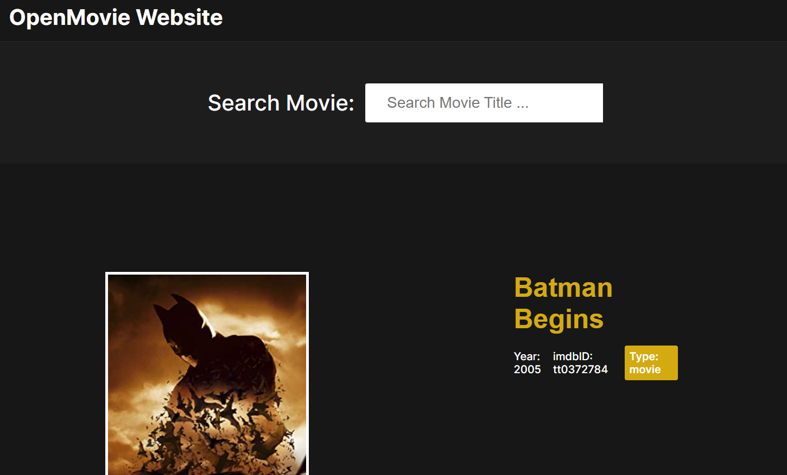
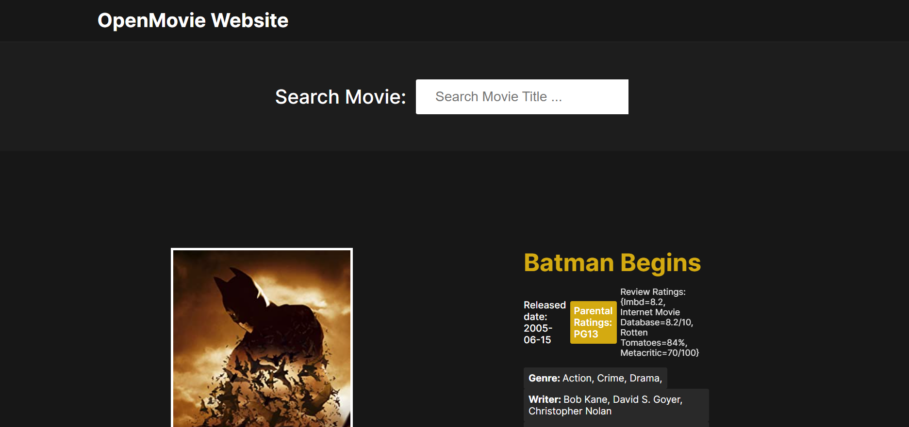

# Movie Search Webapp
## Tech Used:
- Java Springboot - backend
- HTML & CSS - frontend
- OpenMovieAPI

## Overview:
1. User searches for a movie / tv-show by its name. Using: http://localhost:8080/api/v1/openmovie/search/title/{title-name}
2. Using OpenMovieAPI, returns the 10 most relevant movies & tv-shows for this search, and displays this for the user.
3. The user can click on any of the returned items and it will go to that specific URL with more detailed information about the movie / tv-show, using http://localhost:8080/api/v1/openmovie/search/imdbID/{imdbID}

## Examples:
Searching for "Batman":

Clicking on the 1st item returned from Search results:

## How to set up:
1. Insert your specific OpenMovieAPI key into the application.properties file in the resources folder.
2. Start up application and go to http://localhost:8080/api/v1/openmovie/search/title/{title-name} and search for your favourite movies & tv-shows.